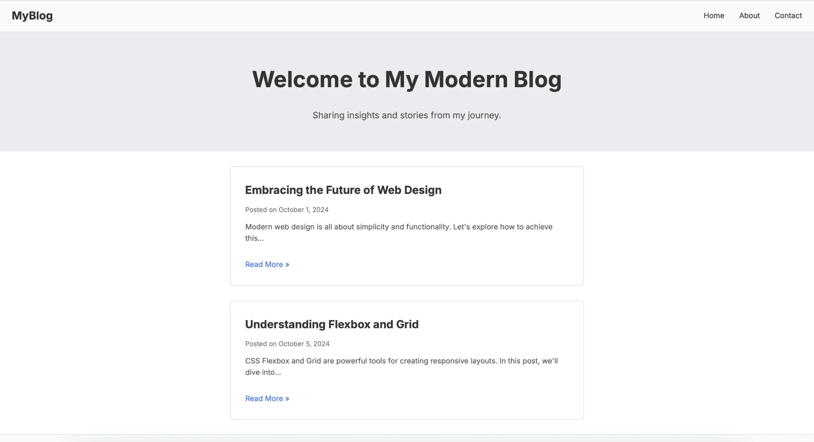

# OpenAI o1 coded personal blog

This project is a simple, personalized blog created using HTML, CSS, and JavaScript, with assistance from o1-preview . It demonstrates basic web development concepts and can serve as a starting point for building more complex blog systems.

## Table of Contents
1. [Project Structure](#project-structure)
2. [File Contents](#file-contents)
3. [Running the Project Locally](#running-the-project-locally)
4. [Customization](#customization)
5. [Deployment](#deployment)
6. [Website Screenshots](#website-screenshots)
7. [Future Enhancements](#future-enhancements)
8. [Prompts Used to Generate This Project](#prompts-used-to-generate-this-project)
9. [About This Project](#about-this-project)

## Project Structure

The project consists of three main files:

1. `index.html`: The main HTML file that structures the blog page.
2. `styles.css`: Contains all the CSS for styling the blog.
3. `scripts.js`: JavaScript file for dynamically rendering blog posts.

## File Contents

### index.html

```html
<!DOCTYPE html>
<html lang="en">
<head>
    <meta charset="UTF-8">
    <title>My Personalized Blog</title>
    <link rel="stylesheet" href="styles.css">
</head>
<body>
    <header>
        <h1>Welcome to My Blog</h1>
    </header>
    <main id="blog-posts">
        <!-- Blog posts will be inserted here -->
    </main>
    <footer>
        <p>&copy; 2024 Your Name</p>
    </footer>
    <script src="scripts.js"></script>
</body>
</html>
```

### styles.css

```css
body {
    font-family: Arial, sans-serif;
    margin: 0;
    padding: 0;
}

header, footer {
    background-color: #282c34;
    color: white;
    text-align: center;
    padding: 1em 0;
}

main {
    padding: 2em;
}

article {
    border-bottom: 1px solid #ccc;
    margin-bottom: 2em;
    padding-bottom: 1em;
}

h2 {
    color: #333;
}

p.date {
    color: #777;
    font-size: 0.9em;
}
```

### scripts.js

```javascript
const posts = [
    {
        title: "My First Blog Post",
        date: "September 12, 2024",
        content: "This is the content of my first blog post. Welcome to my blog!"
    },
    {
        title: "Another Day, Another Post",
        date: "September 13, 2024",
        content: "Here's some more content for my blog. Stay tuned for more updates."
    }
];

function renderPosts() {
    const blogPosts = document.getElementById('blog-posts');
    posts.forEach(post => {
        const article = document.createElement('article');
        article.innerHTML = `
            <h2>${post.title}</h2>
            <p class="date">Posted on ${post.date}</p>
            <p>${post.content}</p>
        `;
        blogPosts.appendChild(article);
    });
}

document.addEventListener('DOMContentLoaded', renderPosts);
```

## Running the Project Locally

To run this project on your local machine:

1. Clone this repository to your local machine.
2. Navigate to the project directory.
3. Open `index.html` in a web browser to view your blog.

Alternatively, if you're using Visual Studio Code:

1. Install the "Live Server" extension.
2. Right-click on `index.html` and select "Open with Live Server".

This will open your blog in a web browser and automatically refresh when you make changes.

## Customization

Feel free to customize the content, styles, and functionality to make this blog your own:

- Update the blog posts in the `posts` array in `scripts.js`.
- Modify the styles in `styles.css` to change the look of your blog.
- Add new features or sections to `index.html` as needed.

## Deployment

To deploy this blog, you can use services like GitHub Pages, Netlify, or any web hosting provider that supports static websites.

## Website Screenshots

Here are some screenshots of the blog in action:



## Future Enhancements

Consider adding these features to enhance your blog:

- Responsive design for mobile devices
- A comments section
- Multiple pages or a navigation menu
- Integration with a backend for dynamic content management

## Prompts Used to Generate This Project

This project was created in response to the following prompts:

1. Initial prompt: "create a personalized blog page with all coding"
   
   This prompt initiated the creation of the basic HTML, CSS, and JavaScript files for the blog.

2. Follow-up prompt: "how can I run this code on local"
   
   This prompt led to the creation of instructions on how to run the blog locally, which are included in the "Running the Project Locally" section of this README.


These prompts guided the development process and shaped the final structure and content of this project.

## About This Project

This project was generated with assistance from OpenAI o1, demonstrating AI-human collaboration in web development. The repository name and structure reflect this unique creation process.

